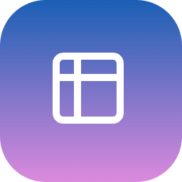
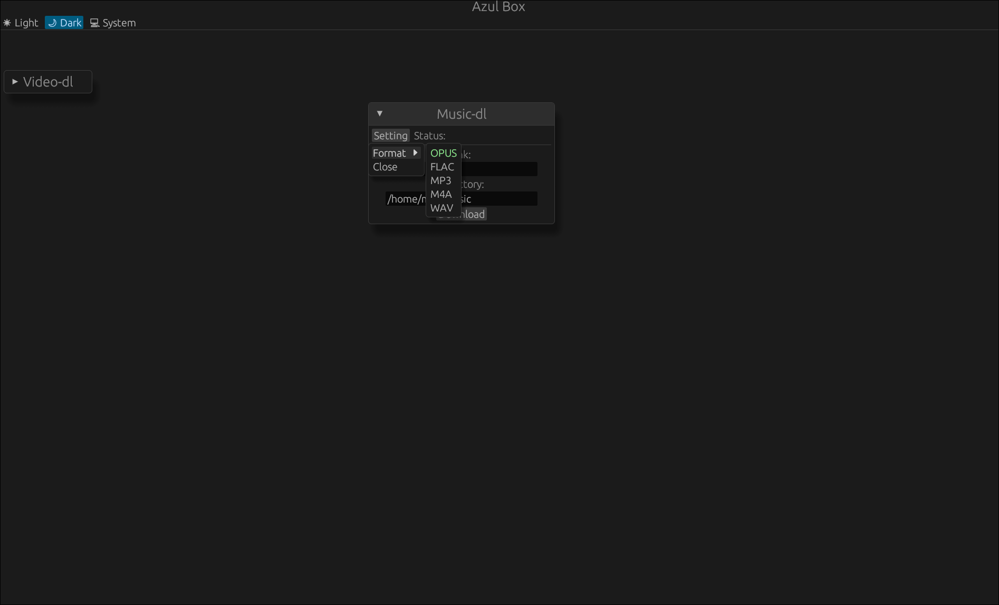

# Azul Box
</img>

## Feature

- Download music from link with metadata/cover embedded with synced lyric(lyric do not work for WAV)
- Download Video from link with highest quality with some metadata embeded
- Download Pin from pinterest without account
- Convert Images formats powered by ffmpeg
- Convert Video formats powered by ffmpeg
- A trash color picker

The video/music download will technically support all yt-dlp [support list](https://github.com/yt-dlp/yt-dlp/blob/master/supportedsites.md) not just youtube.

The features will be really random because this is a software I made to randomly do something I needed.

## Dependencies

- [rustup](https://rustup.rs/)
- ffmpeg & ffprobe
- yt-dlp
- mutagen

### Archlinux:

Install [rustup](https://rustup.rs/)

```
sudo pacman -S ffmpeg yt-dlp python-mutagen
```

### Linuxmint:

Install [rustup](https://rustup.rs/)

```
sudo apt install ffmpeg yt-dlp python3-mutagen
```

### openSUSE Tumbleweed:

Install [rustup](https://rustup.rs/)

You may need to add some extra official opensuse repo.

```
sudo zypper in yt-dlp python-mutagen
```

### Fedora(non atomic):

Install [rustup](https://rustup.rs/)

```
sudo dnf install ffmpeg-free yt-dlp python3-mutagen
```

## Installation

Use this follow command to build then install the app. You will still need to install dependencies before run the install script.

#### You may want to use download the release source and build from there instead of clone the repo.
```
git clone https://github.com/musdx/azul-box
cd azul-box
sudo chmod +x install.sh
./install.sh
```

## Uninstallation

```
sudo rm -r /opt/azul_box/
sudo rm /usr/share/icons/azul_box.png
sudo rm ~/.local/share/applications/azul_box.desktop
```

## Showcase

<div align="center">
</img>
</img>
</div>

[v0.1.6.webm](https://github.com/user-attachments/assets/390744b3-a4df-488e-8091-cd92455b69c1)
